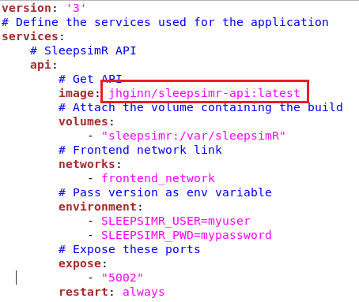

# sleepsimR-documentation

This repository contains the research archive accompanying my Master's thesis. 

## Thesis details and summary

<table>
<thead>
  <tr>
  </tr>
</thead>
<tbody>
  <tr>
    <td>Title</td>
    <td>Sample Size Considerations for Bayesian Multilevel Hidden Markov<br>Models: A Simulation Study and Application to Electroencephalogram<br>(EEG) and Electrooculography (EOG) Data to Detect Sleep States</td>
  </tr>
  <tr>
    <td>Author</td>
    <td>Jasper Ginn</td>
  </tr>
  <tr>
    <td>Supervisor</td>
    <td>Dr. Emmeke Aarts</td>
  </tr>
  <tr>
    <td>Department</td>
    <td>Department of Methodology &amp; Statistics, Utrecht University</td>
  </tr>
  <tr>
    <td>Data collection (period)<br></td>
    <td>November 2019</td>
  </tr>
  <tr>
    <td>Manuscript submitted (period)</td>
    <td>May 2020</td>
  </tr>
</tbody>
</table>

Spurred in part by the ever-growing number of sensors and web-based methods of collecting data, the use of Intensive Longitudinal Data (ILD) is becoming more common in the social and behavioral sciences [1]. The ILD collected in these fields are often hypothesized to be the result of latent states (e.g. behavior, emotions), and the promise of ILD lies in its ability to capture the dynamics of these states as they unfold in time. In particular, by collecting data for multiple subjects, researchers can observe how such dynamics differ between subjects. The Bayesian Multilevel Hidden Markov Model (mHMM) is a relatively novel model that is suited to model the ILD of this kind while taking into account heterogeneity between subjects. In my thesis, I conduct a Monte Carlo simulation study in which I vary (1) the number of subjects, (2) the number of occasions and (3) the between-subject variance and study the effect of varying those quantities on the parameter estimates obtained from the mHMM.

Based on previous studies in the multilevel modeling literature generally and for ILD models more specifically (e.g. [2], [3], [4]), I hypothesize that the subject sample size is the most important determinant of parameter estimate quality. This expectation is largely corroborated in the thesis. However, the occasion sample size is found to be important to adequately model the latent state transitions. I discuss how data characteristics influence parameter estimates and provide recommendations to researchers seeking to apply the mHMM to their own data. 

## Disclaimer

In the instructions given below, I assume that you have access to a bash-like terminal. I also note that you cannot use Docker on [Windows 10 Home](https://docs.docker.com/docker-for-windows/install/), although there is [a workaround](https://medium.com/@mbyfieldcameron/docker-on-windows-10-home-edition-c186c538dff3) that you can use.

## Data management

### 1. Ethical approval

I affirm to have followed professional ethical guidelines in preparing this work. The procedures in this research project were reviewed and granted approval by the Ethics Review Board of the Faculty of Social and Behavioural Sciences at Utrecht University under reference number #19-196. A PDF of the original application may be found in the "documentation" folder.

### 2. Software requirements and installation

The prerequisite software required to re-run this analysis is given below. I provide specific version numbers, and cannot guarantee that this software will work with earlier or later versions.

- [Docker](https://www.docker.com/) (version 19.03.8, build afacb8b7f0)
- [Docker-compose](https://docs.docker.com/compose/) (version 1.21.2)
- [Singularity](https://sylabs.io/docs/) (version 2.6)
- [R](https://www.r-project.org/about.html) (version 3.6.3 (2020-02-29) -- "Holding the Windsock")
- [R-studio](https://rstudio.com/) (version 1.2.5019 "Elderflower" (fba733f0, 2019-10-24))

You need to install the R library "devtools". Please follow the instructions given [here](https://www.r-project.org/nosvn/pandoc/devtools.html).

All R libraries that are required for the project are included in the R libraries that I developed in the course of this thesis and will be automatically installed when you install these libraries.

### 3. Project pipeline

The figure below shows a graphical description of the project pipeline. The pipeline is subdivided into thee major components. The software that was developed for each of these components is listed underneath each of these components.

 <figure>
  
  <figcaption><i>Figure 1: thesis project pipeline from data collection to analysis of the results. I subdivide the pipeline into three major components: (1) data collection and preprocessing, (2) simulation design and execution, and (3) Analysis and empirical application. The software that was developed throughout the project is listed underneath these components.</i></figcaption>
</figure> 
<br>
<br>

The table below lists all the software that I used in the production of my thesis results. Each of the programs is associated with their own Digital Object Identifier (DOI) that is supplied via Zenodo, and should be downloaded from the link provided in the table.

| Name                         	| URL                                                        	| DOI                    	| Version 	| Description                                                                                                                                                                                                                                              	|
|------------------------------	|------------------------------------------------------------	|------------------------	|---------	|----------------------------------------------------------------------------------------------------------------------------------------------------------------------------------------------------------------------------------------------------------	|
| sleepsimR                    	| https://github.com/JasperHG90/sleepsimR                    	| 10.5281/zenodo.3804726 	| 0.5     	| R library that contains convenience functions to generate simulation scenarios, to run an mHMM, to simulate datasets and to obtain MAP estimates.                                                                                                        	|
| sleepsimRdata                	| https://github.com/JasperHG90/sleepsimRdata                	| XXX-XXX-XXX            	| 0.3     	| R library that contains scripts used to generate simulation scenarios and to preprocess the simulation results. This library contains all raw data, summary statistics, simulation scenarios and simulation results obtained in the course of the study. 	|
| sleepsimReval                	| https://github.com/JasperHG90/sleepsimReval                	| 10.5281/zenodo.3804835 	| 0.8     	| R library that contains simulation evaluation metrics and utility functions to parse simulation results and assess convergence of MCMC chains.                                                                                                           	|
| sleepsimR-api                	| https://github.com/JasperHG90/sleepsimR-api                	| 10.5281/zenodo.3727709 	| 1.3.1   	| Docker application. Resource manager that I use to organize my simulation study. This version contains the first 7.000 iterations (approx. 48 iterations / scenario).                                                                                    	|
|                              	|                                                            	| 10.5281/zenodo.3731364 	| 1.3.2   	| This version contains the remaining +- 29.000 iterations of the simulation study.                                                                                                                                                                        	|
|                              	|                                                            	| 10.5281/zenodo.3747158 	| 1.3.3   	| This version contains +- 834 iterations (approx. 6 iterations / scenario) that are used to assess convergence of a small percentage of the models that are estimated in the simulation study.                                                            	|
|                              	|                                                            	| 10.5281/zenodo.3784910 	| 1.5.1   	| This version contains the simulation instructions for baseline scenarios 1 and 2.                                                                                                                                                                        	|
|                              	|                                                            	| 10.5281/zenodo.3784934 	| 1.5.2   	| This version contains the simulation instructions for baseline scenario 5.                                                                                                                                                                               	|
|                              	|                                                            	| 10.5281/zenodo.3786154 	| 1.5.3   	| This version contains the simulation instructions for baseline scenario 3.                                                                                                                                                                               	|
|                              	|                                                            	| 10.5281/zenodo.3793259 	| 1.5.4   	| This version contains the simulation instructions for baseline scenario 4.                                                                                                                                                                               	|
| sleepsimRapiClient           	| https://github.com/JasperHG90/sleepsimRapiClient           	| 10.5281/zenodo.3805052 	| 1.0     	| R library that contains convenience functions to retrieve simulation parameters from the resource manager and allows you to send back the results.                                                                                                       	|
| sleepsimR-run                	| https://github.com/JasperHG90/sleepsimR-run                	| 10.5281/zenodo.3727710 	| 1.3     	| Docker application. Contains the R script that I use to run a single iteration of the simulation study. This version is used with versions 1.3.1, 1.3.2, 1.3.3 of the sleepsimR-api program.                                                             	|
|                              	|                                                            	| 10.5281/zenodo.3778191 	| 1.5.1   	| This version is used with version 1.5.1 (Scenario 1)  of the sleepsimR-api program. In this version, the emission distribution means are spread out.                                                                                                     	|
|                              	|                                                            	| 10.5281/zenodo.3778195 	| 1.5.2   	| This version is used with versions 1.5.1 (Scenario 2), 1.5.3 and 1.5.4 of the sleepsimR-api program. In this version, the emission distribution means are spread out and the self-transition probabilities are lowered.                                  	|
| sleepsimR-sleepdata-analysis 	| https://github.com/JasperHG90/sleepsimR-sleepdata-analysis 	| XXX.XXX.XXX            	| 1.0     	| Docker application. This program allows the user to run a single chain of the model used in the empirical analysis.                                                                                                                                      	|

### 4. Replicating the analysis

Here, I give specific instructions on reproducing the results of the analysis. First, ensure that you have the R libraries "sleepsimR", "sleepsimRdata" and "sleepsimReval" installed on your device. The procedure is the same for all the R libraries, and I only give specific instructions for the R library "sleepsimR".

First, download the R library from the Zenodo link provided in the table in section 3:

```shell
wget https://zenodo.org/record/3804726/files/JasperHG90/sleepsimR-v0.5.zip?download=1 -O sleepsimR-v0.5.zip
```

Unzip the file

```shell
unzip sleepsimR-v0.5.zip
```

In R/Rstudio, install the library as follows:

```R
devtools::install("<PATH-TO-FOLDER>/JasperHG90-sleepsimR-1c2dca4")
```

#### 4.1 Data collection & preprocessing

This analysis uses the [sleep-EDF (expanded)](https://physionet.org/content/sleep-edfx/1.0.0/) dataset. I created several programs to download and preprocess this data directly from the website.

First, download the %%LINK%% sleepsimR-collect and sleepsimR-preprocess programs and unzip the contents in a directory of your choosing;

```shell

```

Enter each repository and build the docker programs:

```shell
cd sleepsimR-collect && docker build . -t jhginn/sleepsimr-collect && cd .. && cd sleepsimR-preprocess && docker build . -t jhginn/sleepsimr-preprocess & cd ..
```

Create a docker volume to store the data:

```shell
docker volume create sleepsimr_data
```

Then, download the first night of EDFX sleep data by executing the following command:

```shell
docker run --rm --mount source=sleepsimr_data,target=/var/sleepsimr_data jhginn/sleepsimr-collect 1:83 1 /var/sleepsimr_data/raw /var/sleepsimr_data/processed
```

Download the second night of EDFX sleep data by executing the following command:

```shell
docker run --rm --mount source=sleepsimr_data,target=/var/sleepsimr_data jhginn/sleepsimr-collect 1:83 2 /var/sleepsimr_data/raw /var/sleepsimr_data/processed
```

Depending on the speed of your internet connection, downloading this database can be quite slow. However, you can stop the program at any time and resume downloading the data using the above commands.

Next, we run the preprocessing container:

```shell
docker run --rm --mount source=sleepsimr_data,target=/var/sleepsimr_data jhginn/sleepsimr-preprocess /var/sleepsimr_data/processed /var/sleepsimr_data/final
```

To copy the data from the docker volume, execute the following commands:

```shell
docker run --mount source=sleepsimr_data,target=/var/sleepsimr_data --name helper busybox
```

```shell
docker cp helper:/var/sleepsimr_data/final/EEG_data_final.rds .
```

Then, remove the busybox container

```shell
docker stop helper && docker rm helper
```

The final preprocessing steps for the `EEG_data_final.rds` data file are conducted in the [sleepsimRdata R library](https://github.com/JasperHG90/sleepsimRdata/blob/master/data-raw/1_preprocess_sleep_data/preprocess_sleep_data.R). The final file is included in the sleepsimRdata R library and can be loaded as follows:

```R
# Load the library
library(sleepsimRdata)
# Load the final EEG dataset
data("sleepdata")
# View documentation about the dataset
?sleepsimRdata::sleepdata
```

Population parameters on which the simulation iterations are based can be generated by following the script found in the "population_parameters" folder.

#### 4.2 Simulation design & execution

The instructions for each simulation iteration are generated in advance by the function [generate_scenarios()](https://github.com/JasperHG90/sleepsimR/blob/master/R/generate_scenarios.R) in the R library 'sleepsimR'. The full set of scenarios is generated by [this script](https://github.com/JasperHG90/sleepsimRdata/blob/master/data-raw/2_make_simulation_scenarios/make_simulation_scenarios.R) that is included in the "sleepsimRdata" R library. This library also includes the full scenarios datasets, which you can access as follows:

```R
# Load the library
library(sleepsimRdata)
# Load data on 29.000 iterations
data("scen")
# View documentation about the dataset
?sleepsimRdata::scen
# View documentation about the different simulation iteration datasets
?sleepsimRdata::scen_rerun
?sleepsimRdata::scen_subs
?sleepsimRdata::scen_baseline
```

The scenarios generated as outlined above contain all necessary information to generate data using the mHMMbayes R library and to run the analysis. Data and model seeds are set at the iteration level, making each simulation iteration exactly replicable. Starting values are defined in advance. I check that the starting values are unique.

Running the Bayesian mHMM is computationally burdensome. In order to run all simulation iterations within a reasonable timeframe, I designed a framework that allows for (in theory) infinite scaling of the number of simulation processes that can run in parallel. This architecture is explained in detail in the [simulation protocol](https://github.com/JasperHG90/sleepsimR-documentation/blob/master/documentation/simulation_protocol_v0.3.pdf) which you may find in the "documentation" folder. 

The design can be summarized as follows:

1. The "sleepsimR-run" program is a docker container that runs a single iteration of the simulation study. Hence, if we have at our disposal a device with 8 CPUs, we can run 8 simulation iterations in parallel.
1. The "sleepsimR-api" program acts as an "accountant". Each time a simulation iteration is started from the "sleepsimR-run" program, it will query a set of simulation parameters (e.g. random seeds, starting values etc.) from the API. When the simulation iteration finishes, the results are then sent back to the API. The API stores these results on disk.

##### 4.2.1 Setting up the simulation API

To run the simulations, I use the [LISA](https://userinfo.surfsara.nl/systems/lisa) high-performance computing (HPC) environment provided by SURF. The table in section 3 lists all of the versions of the API that I use to obtain my results. The process of setting up these scenarios is identical for each version, and hence I only show the required steps for a single version.

First, you need to set up a virtual machine on Google Cloud (or a cloud service provider of your choice). This virtual machine can be quite small; 2 vCPUs and 4GB of RAM should suffice. Make sure to use Ubuntu 18.04 as your operating system and assign an SSD hard drive of at least 30GB. Next, ensure that the virtual machine is publically reachable on port 80. This allows the API to communicate with each of the simulation iteration containers. 

Boot into the virtual machine and follow the instructions given [here](https://www.digitalocean.com/community/tutorials/how-to-install-and-use-docker-on-ubuntu-18-04) to install docker and the instructions given [here](https://www.digitalocean.com/community/tutorials/how-to-install-docker-compose-on-ubuntu-18-04) to install docker compose. 

Next, download a version of the API from one of the Zenodo repositories and unzip it:

```shell
wget https://zenodo.org/record/3727773/files/JasperHG90/sleepsimR-api-v1.3.1.zip?download=1 -O sleepsimR-api-v1.3.1.zip && unzip sleepsimR-api-v1.3.1.zip
```

Build the docker application as follows (NB: change this if you use a different version):

```shell
cd JasperHG90-sleepsimR-api-878f033 && docker build . -t jhginn/sleepsimr-api:version-1.3.1 && cd
```

Create the following docker volumes:

```shell
docker volume create sleepsimr && docker volume create sleepsimrmodels
```

Next, download this research archive on the virtual machine:

```shell
git clone https://github.com/JasperHG90/sleepsimR-documentation.git
```

Copy the following folder to your home directory

```shell
cp -R ~/thesis-docs/pipeline/simulation_design_and_execution/API-google-cloud ~/docker-api
```

Enter this folder and open the "docker-compose.yml" file using the following command:

```shell
nano docker-compose.yml
```

Change that line that is enclosed in the red box in the image below to the version that you are using. For example, I change the line to `jhginn/sleepsimr-api:version-1.3.1`. Hit \<ctrl\> + X and then \<ENTER\> to save your changes.

<figure>
  
</figure> 

Now, execute the following command to start the API:

```shell
docker-compose up -d 
```

The API is now up and running on http://\<YOUR-VM-IP-ADDRESS\>/6532a6c0213d9ac79f2101838e40e041

##### 4.2.2 Running the simulation iterations on the LISA HPC

##### 4.2.1 Running the simulation iterations on a VM

#### 4.3 Analysis & empirical application

### 6. (Final) datasets

### 7. Analyses and plots

## Privacy

## Permission and access

## References

# Docker container --> running iterations

1. docker volume create sleepsimrmodels
2. cd run-simulations-docker-compose && docker-compose up --scale iteration=3 -d

# Setting up the API server

docker run --mount source=sleepsimR,target=/var/sleepsimR --name helper busybox
