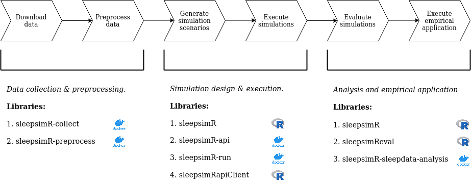

# sleepsimR-documentation

[](https://zenodo.org/badge/latestdoi/263343539)   

<!-- -->

This repository contains the research archive accompanying my Master's thesis. 

## Thesis details and summary

<table>
<thead>
  <tr>
  </tr>
</thead>
<tbody>
  <tr>
    <td>Title</td>
    <td>Sample Size Considerations for Bayesian Multilevel Hidden Markov<br>Models: A Simulation Study and Application to Electroencephalogram<br>(EEG) and Electrooculography (EOG) Data to Detect Sleep States</td>
  </tr>
  <tr>
    <td>Author</td>
    <td>Jasper Ginn</td>
  </tr>
  <tr>
    <td>Supervisor</td>
    <td>Dr. Emmeke Aarts</td>
  </tr>
  <tr>
    <td>Department</td>
    <td>Department of Methodology &amp; Statistics, Utrecht University</td>
  </tr>
  <tr>
    <td>Data collection (period)<br></td>
    <td>November 2019</td>
  </tr>
  <tr>
    <td>Manuscript submitted (period)</td>
    <td>May 2020</td>
  </tr>
</tbody>
</table>

Spurred in part by the ever-growing number of sensors and web-based methods of collecting data, the use of Intensive Longitudinal Data (ILD) is becoming more common in the social and behavioral sciences. The ILD collected in these fields are often hypothesized to be the result of latent states (e.g. behavior, emotions), and the promise of ILD lies in its ability to capture the dynamics of these states as they unfold in time. In particular, by collecting data for multiple subjects, researchers can observe how such dynamics differ between subjects. The Bayesian Multilevel Hidden Markov Model (mHMM) is a relatively novel model that is suited to model the ILD of this kind while taking into account heterogeneity between subjects. In my thesis, I conduct a Monte Carlo simulation study in which I vary (1) the number of subjects, (2) the number of occasions and (3) the between-subject variance and study the effect of varying those quantities on the parameter estimates obtained from the mHMM.

Based on previous studies in the multilevel modeling literature generally and for ILD models more specifically, I hypothesize that the subject sample size is the most important determinant of parameter estimate quality. This expectation is largely corroborated in the thesis. However, the occasion sample size is found to be important to adequately model the latent state transitions. I discuss how data characteristics influence parameter estimates and provide recommendations to researchers seeking to apply the mHMM to their own data. 

The full manuscript is available under the folder "/manuscript"

## Disclaimer

In the instructions given below, I assume that you have access to a bash-like terminal. I also note that you cannot use Docker on [Windows 10 Home](https://docs.docker.com/docker-for-windows/install/), although there is [a workaround](https://medium.com/@mbyfieldcameron/docker-on-windows-10-home-edition-c186c538dff3) that you can use.

## A. Data storage

### 1. Software requirements and installation

The prerequisite software required to re-run this analysis is given below. I provide specific version numbers, and cannot guarantee that this software will work with earlier or later versions.

- [Docker](https://www.docker.com/) (version 19.03.8, build afacb8b7f0)
- [Docker-compose](https://docs.docker.com/compose/) (version 1.21.2)
- [Singularity](https://sylabs.io/docs/) (version 2.6)
- [R](https://www.r-project.org/about.html) (version 3.6.3 (2020-02-29) -- "Holding the Windsock")
- [R-studio](https://rstudio.com/) (version 1.2.5019 "Elderflower" (fba733f0, 2019-10-24))

You need to install the R library "devtools". Please follow the instructions given [here](https://www.r-project.org/nosvn/pandoc/devtools.html).

All R libraries that are required for the project are included in the R libraries that I developed in the course of this thesis and will be automatically installed when you install these libraries.

### 2. Project pipeline

The figure below shows a graphical description of the project pipeline. The pipeline is subdivided into thee major components. The software that was developed for each of these components is listed underneath each of these components.

<figure>
  
  <figcaption><i>Figure 1: thesis project pipeline from data collection to analysis of the results. I subdivide the pipeline into three major components: (1) data collection and preprocessing, (2) simulation design and execution, and (3) Analysis and empirical application. The software that was developed throughout the project is listed underneath these components.</i></figcaption>
</figure> 
<br>
<br>

The table below lists all the software that I used in the production of my thesis results. Each of the programs is associated with their own Digital Object Identifier (DOI) that is supplied via Zenodo, and should be downloaded from the link provided in the table.

<table>
<caption><i>Table 1: overview of the software developed in the course of this thesis. The versions listed in this table are the ones used to generate all results in the thesis. Each software version is stored using a unique Digital Object Identifier (DOI), and should be downloaded from the link provided in the table.</i></caption>
<thead>
  <tr>
    <th>Name</th>
    <th>DOI (URL to archived version)<br></th>
    <th>Download ZIP<br></th>
    <th>Version</th>
    <th>Description</th>
  </tr>
</thead>
<tbody>
  <tr>
    <td>sleepsimR-collect</td>
    <td><a href="https://doi.org/10.5281/zenodo.3826081">DOI: 10.5281/zenodo.3826081</a></td>
    <td><a href="https://zenodo.org/record/3826081/files/JasperHG90/sleepsimR-collect-v0.3.zip?download=1" target="_blank" rel="noopener noreferrer">Download</a></td>
    <td>0.3</td>
    <td>Docker application that downloads the sleep-edfx database.</td>
  </tr>
  <tr>
    <td>sleepsimR-preprocess</td>
    <td><a href="https://doi.org/10.5281/zenodo.3826082">DOI: 10.5281/zenodo.3826082</a></td>
    <td><a href="https://zenodo.org/record/3826082/files/JasperHG90/sleepsimR-preprocess-v0.3.zip?download=1" target="_blank" rel="noopener noreferrer">Download</a></td>
    <td>0.3</td>
    <td>This docker application preprocesses the downloaded sleep-edfx database. </td>
  </tr>
  <tr>
    <td>sleepsimR</td>
    <td><a href="https://doi.org/10.5281/zenodo.3826088">DOI: 10.5281/zenodo.3826088</a></td>
    <td><a href="https://zenodo.org/record/3826088/files/JasperHG90/sleepsimR-v0.6.zip?download=1" target="_blank" rel="noopener noreferrer">Download</a><br></td>
    <td>0.6</td>
    <td>R library that contains convenience functions to generate simulation scenarios, to run an mHMM, to simulate datasets and to obtain MAP estimates.</td>
  </tr>
  <tr>
    <td>sleepsimRdata</td>
    <td><a href="https://doi.org/10.5281/zenodo.3826139">DOI: 10.5281/zenodo.3826139</a></td>
    <td><a href="https://zenodo.org/record/3826139/files/JasperHG90/sleepsimRdata-v0.3.zip?download=1" target="_blank" rel="noopener noreferrer">Download</a><br></td>
    <td>0.3</td>
    <td>R library that contains scripts used to generate simulation scenarios and to preprocess the simulation results. This library contains all raw data, summary statistics, simulation scenarios and simulation results obtained in the course of the study.</td>
  </tr>
  <tr>
    <td>sleepsimReval</td>
    <td><a href="https://doi.org/10.5281/zenodo.3826140">DOI: 10.5281/zenodo.3826140</a></td>
    <td><a href="https://zenodo.org/record/3826140/files/JasperHG90/sleepsimReval-v0.8.1.zip?download=1" target="_blank" rel="noopener noreferrer">Download</a></td>
    <td>0.8.1</td>
    <td>R library that contains simulation evaluation metrics and utility functions to parse simulation results and assess convergence of MCMC chains.</td>
  </tr>
  <tr>
    <td>sleepsimR-api</td>
    <td><a href="https://doi.org/10.5281/zenodo.3727773">DOI: 10.5281/zenodo.3727773</a></td>
    <td><a href="https://zenodo.org/record/3727773/files/JasperHG90/sleepsimR-api-v1.3.1.zip?download=1" target="_blank" rel="noopener noreferrer">Download</a><br></td>
    <td>1.3.1</td>
    <td>Docker application. Resource manager that I use to organize my simulation study. This version contains the first 7.000 iterations (approx. 48 iterations / scenario).</td>
  </tr>
  <tr>
    <td></td>
    <td><a href="https://doi.org/10.5281/zenodo.3731364">DOI: 10.5281/zenodo.3731364</a></td>
    <td><a href="https://zenodo.org/record/3731364/files/JasperHG90/sleepsimR-api-v1.3.2.zip?download=1" target="_blank" rel="noopener noreferrer">Download</a></td>
    <td>1.3.2</td>
    <td>This version contains the remaining +- 29.000 iterations of the simulation study.</td>
  </tr>
  <tr>
    <td></td>
    <td><a href="https://doi.org/10.5281/zenodo.3747158">DOI: 10.5281/zenodo.3747158</a></td>
    <td><a href="https://zenodo.org/record/3747158/files/JasperHG90/sleepsimR-api-v1.3.3.zip?download=1" target="_blank" rel="noopener noreferrer">Download</a><br></td>
    <td>1.3.3</td>
    <td>This version contains +- 834 iterations (approx. 6 iterations / scenario) that are used to assess convergence of a small percentage of the models that are estimated in the simulation study.</td>
  </tr>
  <tr>
    <td></td>
    <td><a href="https://doi.org/10.5281/zenodo.3784910">DOI: 10.5281/zenodo.3784910</a></td>
    <td><a href="https://zenodo.org/record/3784910/files/JasperHG90/sleepsimR-api-1.5.1.zip?download=1" target="_blank" rel="noopener noreferrer">Download</a><br></td>
    <td>1.5.1</td>
    <td>This version contains the simulation instructions for baseline scenarios 1 and 2.</td>
  </tr>
  <tr>
    <td></td>
    <td><a href="https://doi.org/10.5281/zenodo.3784934">DOI: 10.5281/zenodo.3784934</a></td>
    <td><a href="https://zenodo.org/record/3784934/files/JasperHG90/sleepsimR-api-1.5.2.zip?download=1" target="_blank" rel="noopener noreferrer">Download</a><br></td>
    <td>1.5.2</td>
    <td>This version contains the simulation instructions for baseline scenario 5.</td>
  </tr>
  <tr>
    <td></td>
    <td><a href="https://doi.org/10.5281/zenodo.3786154">DOI: 10.5281/zenodo.3786154</a></td>
    <td><a href="https://zenodo.org/record/3786154/files/JasperHG90/sleepsimR-api-v1.5.3.zip?download=1" target="_blank" rel="noopener noreferrer">Download</a><br></td>
    <td>1.5.3</td>
    <td>This version contains the simulation instructions for baseline scenario 3.</td>
  </tr>
  <tr>
    <td></td>
    <td><a href="https://doi.org/10.5281/zenodo.3793259">DOI: 10.5281/zenodo.3793259</a></td>
    <td><a href="https://zenodo.org/record/3793259/files/JasperHG90/sleepsimR-api-v1.5.4.zip?download=1" target="_blank" rel="noopener noreferrer">Download</a><br></td>
    <td>1.5.4</td>
    <td>This version contains the simulation instructions for baseline scenario 4.</td>
  </tr>
  <tr>
    <td>sleepsimRapiClient</td>
    <td><a href="https://doi.org/10.5281/zenodo.3805052">DOI: 10.5281/zenodo.3805052</a><br></td>
    <td><a href="https://zenodo.org/record/3805052/files/JasperHG90/sleepsimRapiClient-v1.zip?download=1" target="_blank" rel="noopener noreferrer">Download</a><br></td>
    <td>1.0</td>
    <td>R library that contains convenience functions to retrieve simulation parameters from the resource manager and allows you to send back the results.<br></td>
  </tr>
  <tr>
    <td>sleepsimR-run</td>
    <td><a href="https://doi.org/10.5281/zenodo.3727710">DOI: 10.5281/zenodo.3727710</a></td>
    <td><a href="https://zenodo.org/record/3727710/files/JasperHG90/sleepsimR-run-v1.3.zip?download=1" target="_blank" rel="noopener noreferrer">Download</a></td>
    <td>1.3</td>
    <td>Docker application. Contains the R script that I use to run a single iteration of the simulation study. This version is used with versions 1.3.1, 1.3.2, 1.3.3 of the sleepsimR-api program.</td>
  </tr>
  <tr>
    <td></td>
    <td><a href="https://doi.org/10.5281/zenodo.3778191">DOI: 10.5281/zenodo.3778191</a></td>
    <td><a href="https://zenodo.org/record/3778191/files/JasperHG90/sleepsimR-run-v1.5.1.zip?download=1" target="_blank" rel="noopener noreferrer">Download</a><br></td>
    <td>1.5.1</td>
    <td>This version is used with version 1.5.1 (Scenario 1)  of the sleepsimR-api program. In this version, the emission distribution means are spread out.</td>
  </tr>
  <tr>
    <td></td>
    <td><a href="https://doi.org/10.5281/zenodo.3778195">DOI: 10.5281/zenodo.3778195</a></td>
    <td><a href="https://zenodo.org/record/3778195/files/JasperHG90/sleepsimR-run-v1.5.2.zip?download=1" target="_blank" rel="noopener noreferrer">Download</a><br></td>
    <td>1.5.2</td>
    <td>This version is used with versions 1.5.1 (Scenario 2), 1.5.3 and 1.5.4 of the sleepsimR-api program. In this version, the emission distribution means are spread out and the self-transition probabilities are lowered.</td>
  </tr>
  <tr>
    <td>sleepsimR-sleepdata-analysis</td>
    <td><a href="https://doi.org/10.5281/zenodo.3826163">DOI: 10.5281/zenodo.3826163</a></td>
    <td><a href="https://zenodo.org/record/3826163/files/JasperHG90/sleepsimR-sleepdata-analysis-v0.5.zip?download=1" target="_blank" rel="noopener noreferrer">Download</a><br></td>
    <td>0.5<br></td>
    <td>Docker application. This program allows the user to run a single chain of the model used in the empirical analysis.</td>
  </tr>
</tbody>
</table>

### 3. Replicating the analysis

Here, I give specific instructions on reproducing the results of the analysis. First, ensure that you have the R libraries "sleepsimR", "sleepsimRdata" and "sleepsimReval" installed on your device. The procedure is the same for all the R libraries, and I only give specific instructions for the R library "sleepsimR".

First, download the R library from the Zenodo link provided in the table 1:

```shell
wget https://zenodo.org/record/3826088/files/JasperHG90/sleepsimR-v0.6.zip?download=1 -O sleepsimR-v0.6.zip
```

Unzip the file

```shell
unzip sleepsimR-v0.6.zip
```

In R/Rstudio, install the library as follows:

```R
devtools::install("<PATH-TO-FOLDER>/JasperHG90-sleepsimR-75fca08")
```

In general, the functions in the R libraries are well-documented and should provide you with more specific information. After installing the library, you can search for it using the R-studio functionality:

<figure>
  
</figure> 

By clicking on a library, you can view all functions that it contains. Clicking on these functions brings you to their documentation.

<figure>
  
</figure> 


#### 3.1 Data collection & preprocessing

This analysis uses the [sleep-EDF (expanded)](https://physionet.org/content/sleep-edfx/1.0.0/) dataset. I created several programs to download and preprocess this data directly from the website. Please view the instructions to download and preprocess the data [here](https://github.com/JasperHG90/sleepsimR-documentation/blob/master/pipeline/1_data_collection_and_preprocess/collect_and_preprocess.md).

The final data file is included in the sleepsimRdata R library and can be loaded as follows:

```R
# Load the library
library(sleepsimRdata)
# Load the final EEG dataset
data("sleepdata")
# View documentation about the dataset
?sleepsimRdata::sleepdata
```

Population parameters on which the simulation iterations are based can be generated by following the script found in the "population_parameters" folder.

#### 3.2 Simulation design & execution

##### 3.2.1 Generating the simulation scenario settings

The instructions for each simulation iteration are generated in advance by the function [generate_scenarios()](https://github.com/JasperHG90/sleepsimR/blob/master/R/generate_scenarios.R) in the R library 'sleepsimR'. The full set of scenarios is generated by [this script](https://github.com/JasperHG90/sleepsimRdata/blob/master/data-raw/2_make_simulation_scenarios/make_simulation_scenarios.R) that is included in the "sleepsimRdata" R library. This library also includes the full scenarios datasets, which you can access as follows:

```R
# Load the library
library(sleepsimRdata)
# Load data on 29.000 iterations
data("scen")
# View documentation about the dataset
?sleepsimRdata::scen
# View documentation about the different simulation iteration datasets
?sleepsimRdata::scen_rerun
?sleepsimRdata::scen_subs
?sleepsimRdata::scen_baseline
```

The scenarios generated as outlined above contain all necessary information to generate data using the mHMMbayes R library and to run the analysis. Data and model seeds are set at the iteration level, making each simulation iteration exactly replicable. Starting values are defined in advance. I check that the starting values are unique. The script that is used to generate simulated data and run a model is provided by the "sleepsimR-run" program. You can view the code of the latest release of this program [here](https://github.com/JasperHG90/sleepsimR-run/blob/master/app/run_sleepsimR.R#L106-L146). The functions used to generate the data and run the model are called [generate_data()](https://github.com/JasperHG90/sleepsimR/blob/master/R/simulate.R) and [run_mHMM()](https://github.com/JasperHG90/sleepsimR/blob/master/R/run_model.R). These functions are provided in the "sleepsimR" library, and their help files contain more specific information.

##### 3.2.2 Short description of the simulation design

Running the Bayesian mHMM is computationally burdensome. In order to run all simulation iterations within a reasonable timeframe, I designed a framework that allows for (in theory) infinite scaling of the number of simulation processes that can run in parallel. This architecture is explained in detail in the [simulation protocol](https://github.com/JasperHG90/sleepsimR-documentation/blob/master/documentation/simulation_protocol_v0.3.pdf) which you may find in the "documentation" folder. 

The design can be summarized as follows:

1. The "sleepsimR-run" program is a docker container that runs a single iteration of the simulation study. Hence, if we have at our disposal a device with 8 CPUs, we can run 8 simulation iterations in parallel.
1. The "sleepsimR-api" program acts as an "accountant". Each time a simulation iteration is started from the "sleepsimR-run" program, it will query a set of simulation parameters (e.g. random seeds, starting values etc.) from the API. When the simulation iteration finishes, the results are then sent back to the API. The API stores these results on disk. This program contains the scenario files described under 3.2.1.

##### 3.2.3 Setting up the simulation API

To run the simulations, I use the [LISA](https://userinfo.surfsara.nl/systems/lisa) high-performance computing (HPC) environment provided by [SURFSara](https://userinfo.surfsara.nl/). Table 1 lists all of the versions of the API that I use to obtain my results. The process of setting up these scenarios is identical for each version, and hence I only show the required steps for a single version.

First, you need to set up a virtual machine on Google Cloud (or a cloud service provider of your choice). This virtual machine can be quite small; 2 vCPUs and 4GB of RAM should suffice. Make sure to use Ubuntu 18.04 as your operating system and assign an SSD hard drive of at least 30GB. Next, ensure that the virtual machine is publically reachable on port 80. This allows the API to communicate with each of the simulation iteration containers. 

View the instructions to set up the sleepsimR-api program [here](https://github.com/JasperHG90/sleepsimR-documentation/blob/master/pipeline/2_simulation_design_and_execution/API-google-cloud/README.md).

##### 3.2.4 Running the simulation iterations on the LISA HPC

The [LISA system](https://userinfo.surfsara.nl/systems/lisa) uses Slurm to manage jobs executed by users. Given that docker requires root access, we cannot use it with this cluster. Instead, we can use singularity.

Instructions on creating a Singularity image from a local docker file can be found [here](https://github.com/JasperHG90/sleepsimR-documentation/blob/master/pipeline/2_simulation_design_and_execution/run-simulations-surf-lisa/create_singularity_image.md).

Instructions on preparing the jobscript used to execute the simulations can be found [here](https://github.com/JasperHG90/sleepsimR-documentation/blob/master/pipeline/2_simulation_design_and_execution/run-simulations-surf-lisa/create_slurm_batch_job.md).

Please refer to the official [LISA documentation](https://userinfo.surfsara.nl/systems/lisa/user-guide/creating-and-running-jobs) on how to execute jobs using slurm.

##### 3.2.5 Post-processing the simulation results

Once the simulations are finished, you can copy the result files on the server that hosts the API by using the following command:

```shell
docker cp docker-api_api_1:/var/sleepsimR sleepsimr-results
```

You can then copy these results to your own device.

The scripts found in ["data-raw/3_preprocess_simulation_results"](https://github.com/JasperHG90/sleepsimRdata/tree/master/data-raw/3_preprocess_simulation_results) and ["data-raw/5_preprocess_baseline_results"](https://github.com/JasperHG90/sleepsimRdata/tree/master/data-raw/5_preprocess_baseline_results) in the sleepsimRdata R library provide instructions on parsing the results of the simulation study. 

The final results are included in the sleepsimRdata R library and can be accessed as follows:

```r
# Load the library
library(sleepsimRdata)
# Load the simulation results for the between-subject means
#  (component distribution fixed effects)
data("simulation_data_emiss_means")
# This data file contains the raw simulation results as well as the
#  evaluation metrics for each simulation scenario
raw_results <- simulation_data_emiss_means$data_preprocessed # Raw data
sim_results <- simulation_data_emiss_means$summary_by_scenario # Simulation results by scenario
# View R help files for each of the datasets
?sleepsimRdata::scen_out_zeta_025
?sleepsimRdata::scen_out_zeta_05
?sleepsimRdata::simulation_data_emiss_means
?sleepsimRdata::simulation_data_emiss_varmu
?sleepsimRdata::simulation_data_gamma_prob
```

#### 3.3 Analysis & empirical application

##### 3.3.1 Analysis of simulation results: model convergence

To assess model convergence, I created a small shiny application that you can find under "pipeline/3_analysis_and_empirical_application/shiny-app-model-convergence". To use this shiny application, install the following prerequisites in your R environment:

```R
install.packages(c("dplyr", "shiny", "shinyjs"))
```

Then, put the stored results of the first model chain under "data/simulations". Place the second chain under "data/rerun". 

Open the 'sleepsimR-convergence.Rproj' R project and click on "run app". The results of the analysis will be stored in a root file called "history.rds".

The results of my analysis are included in the above folder.

##### 3.3.2 Analysis of simulation results: assessment and figures

The main analysis of the simulation results can be found in the folder "pipeline/3_analysis_and_empirical_application/analysis-simulation-results".

##### 3.3.1 Empirical Application: Running the mHMM models

You can replicate my results for the empirical analysis by using the "sleepsimR-sleepdata-analysis" docker program. I **strongly** suggest that you run this model on a cloud VM. Running the mHMM with 20.000 iterations will flood your RAM because, in the limit, the memory footprint is determined by (number of subjects X number of occasions X number of outcome variables X number of component distributions X number of MCMC iterations). Also be aware that running these models will take +- 20 hours each on a reasonably fast machine.

First, download the program by executing:

```shell
wget https://zenodo.org/record/3826163/files/JasperHG90/sleepsimR-sleepdata-analysis-v0.5.zip?download=1 -O sleepsimR-sleepdata-analysis-v0.5.zip
```

Unzip the archive:

```shell
unzip sleepsimR-sleepdata-analysis-v0.5.zip
```

Build the docker image:

```shell
cd JasperHG90-sleepsimR-sleepdata-analysis-a3b44a8 && docker build . -t jhginn/sleepsimr-sleepdata-analysis:version-0.5
```

Run the first chain of the model using the following line of code:

```shell
# Run the docker container
docker run --rm --mount source=sleepsimr_analysis,target=/var/sleepsimr_sleepdata_analysis jhginn/sleepsimr-sleepdata-analysis:version-0.5 20000 10000 --variables EEG_Fpz_Cz_mean_theta EOG_min_beta EOG_median_theta --seed 332245
```

Run the second chain using the following line of code:

```shell
# Run the docker container
docker run --rm --mount source=sleepsimr_analysis,target=/var/sleepsimr_sleepdata_analysis jhginn/sleepsimr-sleepdata-analysis:version-0.5 20000 10000 --variables EEG_Fpz_Cz_mean_theta EOG_min_beta EOG_median_theta --seed 332246
```

Next, copy the models from the docker volume to the host device:

```shell
# Copying the resulting models
docker run --mount source=sleepsimr_analysis,target=/var/sleepsimR --name helper busybox
docker cp helper:/var/sleepsimR models_empirical_application
# Remove helper
docker stop helper && docker rm helper
```

Alternatively, you can download the models that I ran from [here](https://storage.googleapis.com/sleepsimr-analysis/sleepdata_analysis/models.zip).

Finally, place the models you just copied in the "pipeline/3_analysis_and_empirical_application/sleep-data-analysis/models" folder.

##### 3.3.2 Empirical Application: Analysis

The analysis of the empirical application can be found in the folder "pipeline/3_analysis_and_empirical_application/sleep-data-analysis".

## B. Privacy

I affirm to have followed professional ethical guidelines in preparing this work. The procedures in this research project were reviewed and granted approval by the Ethics Review Board of the Faculty of Social and Behavioural Sciences at Utrecht University under reference number #19-196. A PDF of the original application may be found in the "documentation" folder. No new data was collected, and only publically available data was used in this study.

## C. Permission and access

All software developed in the course of this thesis has been assigned a Digital Object Identifier (DOI) and is stored on [Zenodo](https://zenodo.org/). This repository contains all documentation about the thesis. Its DOI is [](https://zenodo.org/badge/latestdoi/263343539). Access to the research archive is open-source.

A copy of this repository (and the other repositories mentioned in table 1) has been stored in the archives of Utrecht University. These data will be stored for a minimum duration of 10 years. As per the [Zenodo data retention policy](https://about.zenodo.org/policies/), the archive will be retained for the lifetime of the repository. This is currently the lifetime of the host laboratory CERN, which currently has an experimental programme defined for the next 20 years at least.
